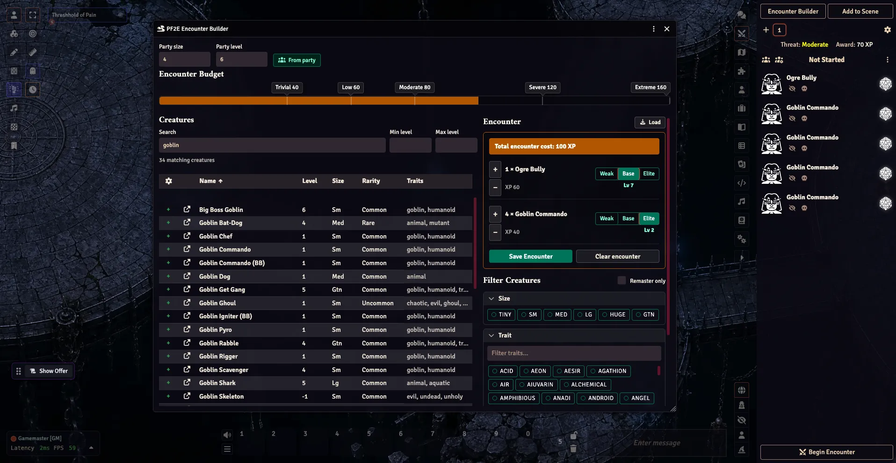

# PF2E Encounter Builder

Plan balanced **Pathfinder 2e** encounters without leaving Foundry VTT. Pull creatures
straight from your installed bestiary compendia, watch the XP budget track from Trivial to
Extreme as you add them, then save the result as a ready-to-run Combat — or drop its tokens
onto the active scene.

- System: `pf2e`
- Foundry: v14 minimum, verified on v14
- Built with TypeScript + Svelte 5 + Vite



> **Prefer the web?** The same encounter math powers the standalone builder at
> **[encounters.runegoblin.com](https://encounters.runegoblin.com)** — no Foundry required.
> This module brings it into your game, wired to your live compendia and combat tracker.

## What it does

- **Budget-aware encounter planning.** Set party size and level (or click **From party** to
  read them off your active party), and the budget bar shows where the encounter lands —
  Trivial, Low, Moderate, Severe, or Extreme — updating live as you add and adjust creatures.

- **Build from your live compendia.** Creatures come from the PF2e Actor compendia you
  actually have installed, indexed by Foundry UUID — not a frozen snapshot. Search by name,
  bound the level range, and filter by size, trait, creature type, and rarity, with an
  optional **Remaster only** toggle.

- **Add creatures any way you like.** Click *Add* in the table, or drag an actor in from the
  sidebar or the compendium browser. Set each entry's count and toggle **Weak / Base / Elite**
  — these apply the real PF2e adjustments, so the budget and the saved actors stay in sync.

- **Save as a Combat.** **Save Encounter** imports the chosen creatures into a *PF2e Encounter
  Builder* actor folder (deduplicated by source and adjustment) and assembles a Combat in the
  tracker, ready to run.

- **Add to Scene when you want tokens.** Saving never auto-places tokens. **Add to Scene**
  drops the combat's missing combatants onto the active scene and links them; it stays disabled
  once every combatant is already placed, so it only ever adds what's missing.

- **Load an existing combat back in.** **Load** is the inverse — it rebuilds the encounter list
  from the combat selected in the tracker, resolving each combatant back to its compendium
  source and Weak/Base/Elite variant, so you can re-balance an encounter you've already set up.

## Install

In Foundry, go to **Add-on Modules → Install Module** and paste the manifest URL:

```
https://github.com/rune-goblin/pf2e-encounter-builder/releases/latest/download/module.json
```

Then enable **PF2E Encounter Builder** in your world (it requires the Pathfinder 2e system).

## Use

The module adds two GM buttons to the **Combat** tab of the sidebar, above *Create Combat*:

1. **Encounter Builder** — opens the planner window. Build your encounter, then **Save
   Encounter** to create the Combat.
2. **Add to Scene** — places the saved combat's tokens on the current scene.

A macro to open the builder ships in the module's *Macros* compendium, and the window is also
available from the console:

```js
game.modules.get('pf2e-encounter-builder').api.open()
```

## Contributing

Building, dev server, tests, project layout, and the release flow live in
[README-dev.md](README-dev.md).

## License

[MIT](LICENSE.md) — use, modify, and build on it freely. This module bundles no Paizo content
of its own; creature data comes from the Pathfinder 2e system and compendia you already have
installed.
</content>
</invoke>
